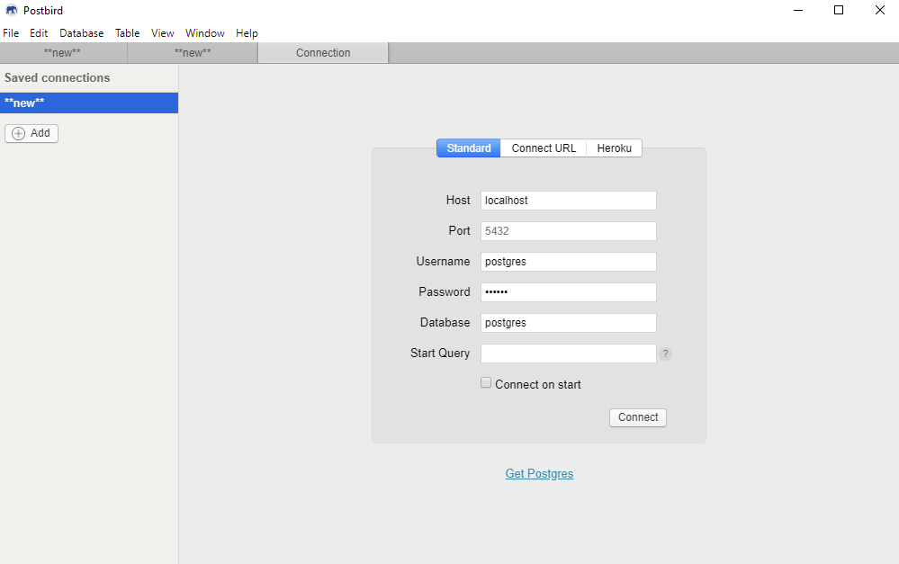
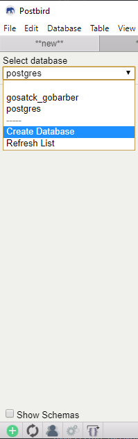
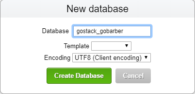

# GoBarber Backend api

<h1 align="center">
    
</h1>


## 📑About
This project is one application created in **Bootcamp GoStack**,for the purpose of recreating a **barber shop** application.

---

## 💻Technologies used

This project was developed using:

- NodeJS
- TypeScript
- Express
- Yarn
- Patterns
- Middlewares
- TypeORM
- Eslint
- Prettier
- Docker
- Migrations

---

## 💾How clone and use this project ?

```bash

    # Clone the repository
    $ git clone https://github.com/TomasSantosz/gobarber_backend_api.git

    # Enter directory
    $ cd gobarber_backend_api

    # Install dependencies
    $ yarn

```

## 🐳Docker

  ### Create new docker container

  ```bash
    docker run --name gostack-postgres -e POSTGRES_PASSWORD=docker -p 5432:5432 -d postgres
  ```

  ### Open in postbird and connect
  <h1 align="left">
    
  </h1>

  ### Create new database with name gostack_gobarber
  <h1 align="left">
    
    
  </h1>

  ### Run migrations
  ```bash
    # Run migrations for your database
    yarn typeorm migration:run
  ```
  ### Run server
  ```bash
    # Run server
    yarn dev:server
  ```
---

## Routes
  ### Users
  #### Update Avatar:
  - **URL:** localhost:3333/users
  - **Method http:** PACTH
  - **Structured:** Multipart Form **Name:** avatar **Value:** image
  #### Create:
  - **URL:** localhost:3333/users
  - **Method http:** POST
  - **Text:** JSON
  - **Params JSON:** {
      "name": "tomas",
      "email" : "email@email.com",
      "password": "tomas"
    }

  ### Sessions
  #### Login:
  - **URL:** localhost:3333/sessions
  - **Method http:** POST
  - **Params JSON:** {
    "email" : "email@email.com",
    "password": "tomas"
  }

  ### Appointment
  ***OBS:. THIS REQUIREMENT REQUIRES TOKEN GENERATED IN LOGIN, USING BEARER TOKEN IN HEADER***
  #### List Appointments:
  - **URL:** localhost:3333/appointments
  - **Method http:** GET

  ***OBS:. THIS REQUIREMENT REQUIRES TOKEN GENERATED IN LOGIN, USING BEARER TOKEN IN HEADER***

  #### Create Appointments:
  - **URL:** localhost:3333/appointments
  - **Method http:** POST
  - **Params JSON:** {
    "provider_id": "d169bdc7-7e17-48e5-b9b8-ae1bb2700a2e",
    "date": ""
  }

  ***"provider_id" -> GENERATED IN CREATE USER. RETURN "ID".***

---

## Functionality to this application
### **Password recovery**
  **RF**
  - The user must be able to recover his password informing his e-mail;
  - The user should receive an email with password recovery instructions;
  - The user must be able to reset his password;

  **RNF**
  - Use Mailtrap to test shipments in a dev environment;
  - Use Amazon SES for production shipments;
  - E-mails should be sent in the background (background job);


  **RN**
  - The link sent by email to reset password, must expire in 2h;
  - The user needs to confirm the new password when resetting his password;
    
### **Profile update**
  **RF**
  
  - The user must be able to update his name, email and password;


  **RN**

  - The user cannot change his email to an email already updated;
  - To update your password, the user must inform the old password;
  - To update your password, the user needs to confirm the new password;
  
### **Provider panel**
  **RF**
  
  - The user must be able to view their schedules for a specific day;
  - The provider must receive a standard whenever there is a new schedule;
  - The provider must be able to view unread notifications;

  **RNF**
  
  - The provider's schedules on the day must be stored in cache;
  - The provider's notifications must be stored in MongoDB;
  - The provider's notifications must be sent in real time using Socket.io;
  
  
  **RN**

  - The notification must have a read or unread status so that the provider can control;
  
### **Agendamento de serviços**

  **RF**
  
  - The user must be able to list all registered service providers;
  - The user must be able to list the days of a month with at least one available time from a provider;
  - The user must be able to list available times on a specific day for a provider;
  - The user must be able to make a new appointment with a provider;

  **RNF**

  - The list of providers must be cached;

  **RN**

  - Each appointment must last exactly 1 hour;
  - Appointments must be available between 8 am and 6 pm (First at 8 am, last at 5 pm);
  - The user cannot schedule at a busy time;
  - The user cannot schedule an appointment that has already passed;
  - The user cannot schedule services with himself;

---
### **Developer Tomás Santos**
#### Github: https://github.com/TomasSantosz
#### LinkedIn: https://www.linkedin.com/in/tom%C3%A1s-santos-3b9617167/